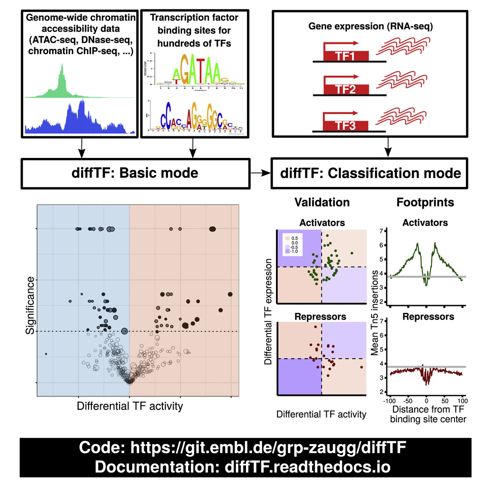
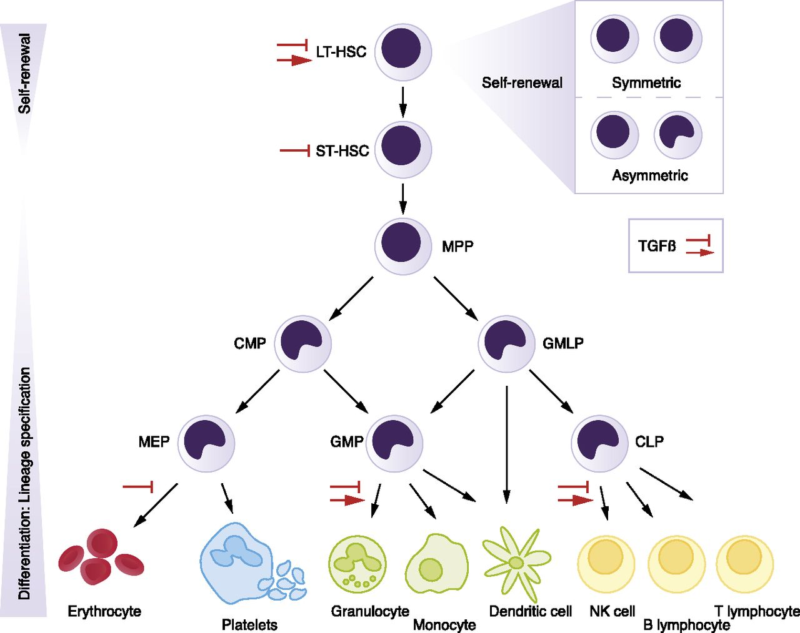

.. _docs-project:

Biological motivation
============================
Transcription factors (TFs) regulate many cellular processes and can therefore serve as readouts of the signaling and regulatory state. Yet for many TFs, the mode of action—repressing or activating transcription of target genes—is unclear. Here, we present diffTF (`https://git.embl.de/grp-zaugg/diffTF <https://git.embl.de/grp-zaugg/diffTF>`_) to calculate differential TF activity (basic mode) and classify TFs into putative transcriptional activators or repressors (classification mode). In basic mode, it combines genome-wide chromatin accessibility/activity with putative TF binding sites that, in classification mode, are integrated with RNA-seq. We apply diffTF to compare (1) mutated and unmutated chronic lymphocytic leukemia patients and (2) two hematopoietic progenitor cell types. In both datasets, diffTF recovers most known biology and finds many previously unreported TFs. It classifies almost 40% of TFs based on their mode of action, which we validate experimentally. Overall, we demonstrate that diffTF recovers known biology, identifies less well-characterized TFs, and classifies TFs into transcriptional activators or repressors.

For a graphical summary of the idea, see the section :ref:`workflow`

This is the graphical abstract:

The paper is open access and available online, please see the section :ref:`citation` for details.

.. _exampleDataset:

Example dataset
=================

We provide a the toy dataset that is included in the Git repository to test diffTF. It is a small ATAC-Seq/RNA-Seq dataset comparing two cell types along the hematopoietic differentiation trajectory in mouse (multipotent progenitors - MPP - versus granulocyte-macrophage progenitors - GMP) and comes from `Rasmussen et al. 2018  <https://www.biorxiv.org/content/early/2018/05/31/336008>`_. Generally, hematopoiesis is organized in a hierarchical manner, and the following Figure shows the hematopoietic hierarchy in more detail and also places GMP and MPP cells:

      U.Blank et. al., Blood 2015 (http://www.bloodjournal.org/content/bloodjournal/125/23/3542/F1.large.jpg)

The data consists of ATAC-Seq data of 4 replicates for each of the two cell types (4 GMP vs. 4 MPP), and is limited to chr1 only to reduce running times and complexity. RNA-seq data are also available, which allows using the TF classification within the diffTF framework. As mentioned in the paper, the small number of samples makes the correlation-based classification of the TFs into activators and repressors unreliable, but we nevertheless include it here for the small dataset to show how to principally enable our AR classification in diffTF.

In the example analysis, you can investigate the differential TF activity of a set of 50 (or even all of the 400+) TFs to identify the known drivers of the well-studied mouse hematopoietic differentiation system. Overall, we expect to see TFs that more specific for stem cells renewal being more active in the MPPs, while in GMPs, TFs responsible for the further myeloid cell differentiation (CEBP family, NFIL3) should be enriched.

Help, contribute and contact
============================

If you have questions or comments, feel free to contact us. We will be happy to answer any questions related to this project as well as questions related to the software implementation. For method-related questions, contact Judith B. Zaugg (judith.zaugg@embl.de) or Ivan Berest (berest@embl.de). For technical questions, contact Christian Arnold (christian.arnold@embl.de).

If you have questions, doubts, ideas or problems, please use the `Bitbucket Issue Tracker <https://bitbucket.org/chrarnold/diffTF>`_. We will respond in a timely manner.

.. _citation:

Citation
============================

If you use this software, please cite the following reference:

Ivan Berest*, Christian Arnold*, Armando Reyes-Palomares, Giovanni Palla, Kasper Dindler Rasmussen, Holly Giles, Peter-Martin Bruch, Wolfgang Huber, Sascha Dietrich, Kristian Helin, Judith B. Zaugg. *Quantification of Differential Transcription Factor Activity and Multiomics-Based Classification into Activators and Repressors: diffTF*. 2019. Cell Reports 29(10), P3147-3159.E12.

Open Access. DOI: `https://doi.org/10.1016/j.celrep.2019.10.106 <https://doi.org/10.1016/j.celrep.2019.10.106>`_

.. We also put the paper on *bioRxiv*, please read all methodological details here:
.. `Quantification of differential transcription factor activity and multiomic-based classification into activators and repressors: diffTF <https://www.biorxiv.org/content/early/2018/12/01/368498>`_.

.. _changelog:

Change log
============================
Version 1.8 (2020-07-15)
  - more stringent criteria for when to include a TF in the binning step. Previously, one bin with data was enough to include the TF. We identified that in rare edge cases, this may not be enough to reliably estimate the TF activity, and now at least 2 distinct bins with enough data are required
  - added a parameter *filterChr* to specify whether or not the sex chromosomes (or any other chromosomes) should be filtered from the peaks. Until now, chrX, chrY and chrM were filtered by default. If the parameter is not set explicitly, the previous behavior will be executed.
  - the summaryFinal step now outputs also the DESeq object as an rds file for the RNA-Seq data. This allows to extract gene counts etc.
  - other minor changes
  - updated TFBS predictions for hg38

Version 1.7.1 (2020-05-20)
  - Fixed one typo in the file ``TF_Gene_TranslationTables/HOCOMOCO_v10/translationTable_mm10.csv``. For the TF PAX5.S, the wrong Ensembl ID was provided (the one for PAX2 and not PAX5). This may have caused differences in the classification for PAX5.S when integrating RNA-seq data. Only this TF is affected, and this was also only an issue forthe combination of mm10 and HOCOMOCO v10. Thanks to Jiang Kan for letting us know!

Version 1.7 (2020-05-14)
  - Multiple small fixes, thanks to Guandong Shang and Jiang Kan for reporting them:

    - The TF name may now contain underscores. Before, that caused an error and is fixed now. We also cleared up the documentation about this.
    - TFs with zero TFBS overlapping with the peaks (and therefore, overlap files with 0 lines) do not cause an error anymore and are skipped in subsequent steps, in analogy to TFs that had between 1 and 10 TFBS.
    - Fixed a bug that caused an error when running the last ``summaryFinal`` step that related to duplicated TFs in the HOCOMOCO table.

  - Implemented a debug mode via the new optional parameter ``debugMode``. This mode may be used to store the R session in a file and can be used to send to us for easier troubleshooting. See the documentation for more details.

Version 1.6 (2020-01-22)
  - The documentation received a major update, in particular the section output files. In addition, a few new methodological figures have been added as well as an interpretation section.

Version 1.5 (2019-12-03)
  - *diffTF* has been published in Cell Reports! See the section :ref:`citation` for details.
  - raw and adjusted p-values for the permutation-based approach can now not be 0 anymore. We now use the approach described `here <https://genomicsclass.github.io/book/pages/permutation_tests.html>`_. In a nutshell, the smallest p-value is now 1/(*nPermutations* + 1), with *nPermutations* denoting the number of permutations and thereby depends on the number of permutations - having more permutations makes the minimum p-value smaller.
  - for plotting TF densities, a fixed bandwidth of 0.1 was used before. We now removed this and bandwidth is determined automatically. We noticed that in some cases, the fixed bandwidth may lead to a smoothing of the density curves while without fixing it, the densities look more rugged. As we do not want to introduce visual artifacts, we decided to remove it.
  - various minor code improvements, particularly related to the AR classification
  - small fixes in the Snakefile

Version 1.4 (2019-09-24)
  - Various small improvements for increasing user experience

    - For the peaks and TF-specific diagnostic plots, the pairwise mean-average plots between pairs of samples has been disabled by default. It was set to a maximum of 5 previously, but due to its time consuming nature and limited usage, we feel this is not needed for most users. We might add a parameter in the future to adjust this more flexibly, contact us if you want to have them back.
    - various small improvements for the various diagnostic plots from the last step (*summaryFinal*), most of which concern classification-related plots and plots for the permutation-based approach

  - For all output tables, *diffTF* now outputs only 2-3 significant digits, which reduces the size of some output tables significantly. The memory footprint is thus overall decreased. More digits are not needed in our opinion.
  - added diagnostic plots for the RNA-Seq data that is used for the classification. These include MA plots (based on original and shrunken log2 fold changes, (non)normalized log count density plots across all samples, and a mean-sd plot),
  - added preliminary support for interaction terms in the design formula. This was not possible before but should now work without *diffTF* failing. if you continue having issues, please let us know.
  - the Singularity image for R has been updated. If you stored a previous version of it on disk, please delete it so it is downloaded anew the next time you run *diffTF*. The image also updates R to version 3.6.1 in the container and corresponding package versions.

Version 1.3.3 (2019-07-25)
  - Fixed a bug that caused erroneously small p-values for the permutation-based approach in cases when the number of permutations that was actually done was smaller than what was specified in the configuration file (e.g., if 1000 permutations have been specified in the configuration file, but only 70 were actually done such as for a typical 4 vs 4 analysis). This is now corrected, and the last step of the pipeline (*summaryFinal*) should be rerun to correct for it. Although this happened in the special circumstances as described above (small number of samples and yet using the permutation-based approach), we apologize for this oversight. Thanks to Frauke Huth for noticing!

Version 1.3.2 (2019-07-24)
  - Fixed the error "unable to find an inherited method for function ‘assay’ for signature ‘"matrix", "character"’" that arises due to a new implementation of the *normOffsets* function from the *csaw* package in versions above 1.14.1. The Singularity image that comes with *diffTF* still uses csaw version 1.14.1, for which the original implementation works fine, but for newer R installations (that is, *csaw* >= 1.16) the above error is thrown. In the code, the function call is now dependent on the version of the *csaw* package. This was the most common error that was thrown when running *diffTF* without Singularity, and should therefore increase compatibility.
  - Minor changes to make the *diffTF* code more compatible for future releases of R (e.g., replacing the deprecated *data_frame* by *tibble*, specifying the package for functions that are defined in different packages)
  - updated the *startAnalysis* scripts due to a changed folder structure in the *examples* subfolder

Version 1.3 and 1.3.1 (2019-07-17)
  - Various minor changes and small bug fixes as reported by users
  - improved the RNA-Seq classification, further information will follow soon.
  - updated Documentation for errors that users reported and why they occur
  - improved error messages in the pipeline for various cases

Version 1.2.5 (2019-03-13)
  - Updated the TFBS_hg38_FIMO_HOCOMOCOv11 archive one more time to exclude non-assembled contigs such as HLA*. To make the pipeline more stable for such edge cases, the parameter ``dir_TFBS_sorted`` has been removed, and sorting and filtering of chromosomes is now always performed. Only chromosomes are kept in both the consensus peak files and the TFBS bed files that start with ``chr`` and are neither sex chromosomes (``chrX`` or ``chrY``) nor ``chrM``. If you want to keep sex chromosomes in your analysis (although we think this is not recommended), simply edit the Snakefile and remove the "chrX" and "chrY" occurences in the two filtering rules.

Version 1.2.4 (2019-03-04)
  - Fixed an issue with ``checkParameterValidity.R`` that caused an error message when loading TFBS files with a numeric score.  Thanks to Scott Berry for pointing it out.
  - Updated the TFBS_hg38_FIMO_HOCOMOCOv11 archive. The bed files are now properly pre-sorted

Version 1.2.3 (2019-02-27)
  - Added a pre-compiled list of 768 human TF with in-silico predicted TFBS based on the *HOCOMOCO 11* database and *PWMScan* for hg38 as well as updating the other pre-compiled lists to account for recent changes and retractions in the *HOCOMOCO* database. See section :ref:`parameter_dir_TFBS` for details.
  - added an additional filtering in the binning step for a rare corner case due to changes in the number of samples during an analysis

Version 1.2.2 (2019-02-01)
    - Minor code fixed. Removed the creation of the circular plot, which has been replaced with the Volcano plot over time. Fixed a bug that could have led to wrong log2 fold-change values for the RNA-Seq data under special circumstances. We recommend rerunning the ``summaryFinal`` rule. Ask us for more details if you are concerned about this.

Version 1.2.1 (2019-01-22)
    - Increased the value for ``expressions`` in R from 5000 (the R default) to 10000. Some users reported that they receive a "Error: evaluation nested too deeply: infinite recursion / options(expressions=)?" error message. Thanks to Benedict Man Hung Choi!

Version 1.2 (2018-12-10)
    - The Snakemake / *diffTF* pipeline can now be combined with **Singularity**. Singularity is similar to Docker and provides a containerization approach. This has significant implications for users: Except for Snakemake and Singularity, no other tool, R or R package has to be installed prior to using *diffTF* anymore, which makes installing *diffTF* much easier and completely independent of the underlying operating system. We now provide two Singularity containers with all necessary tools and packages that are automatically integrated into the workflow. See the section :ref:`docs-singularityNotes` and :ref:`docs-quickstart` for more details. **Please note that for this to work reliably, Snakemake must be updated to at least version 5.3.1**.
    - added two validity checks in the ``checkParameterValidity.R`` script for the TFBS files. Start and end coordinates are now asserted whether they are non-negative.

Version 1.1.8 (2018-11-07)
    - changed the call to the ``mlv`` function from the ``modeest`` package due to a breaking implementation change in version 2.3.2 that was published end of October 2018. *diffTF* now checks the package version for ``modeest`` and calls the functions in dependence of the specific version.

Version 1.1.7 (2018-10-25)
    - the default value of the minimum number of data points for a CG bin to be included has been raised from 5 to 20 to make the variance calculation more reliable
    - various small updates to the ``summaryFinal.R`` script

Version 1.1.6 (2018-10-11)
    - fixed small issue in ``checkParameterValidity.R`` when not having sufficient permissions for the folder in which the fasta file is located
    - updated the ``summaryFinal.R`` script. Now, for the Volcano plot PDF, in addition to adj. p-values, also the raw p-values are plotted in the end. This might be helpful for datasets with small signal when no adj. p-value is significant. In addition, labeling of TFs is now skipped when the number of TFs to label exceeds 150. THis makes the step faster and the PDF smaller and less crowded.
    - small updates to the translation table for mm10
    - adding two local rules to the Snakefile for potential minor speed improvements when running in cluster mode

Version 1.1.5 (2018-08-14)
    - optimized ``checkParameterValidity.R`` script, only TFBS files for TFs included in the analysis are now checked
    - addressed an R library compatibility issue independent of *diffTF* that users reported. In some cases, for particular versions of R and Bioconductor, R exited with a *segfault* (memory not mapped) error in the ``checkParameterValidity.R`` that seems to be caused by the combination of *DiffBind* and *DESeq2*. Specifically, when *DiffBind* is loaded *before* *DESeq2*, R crashes with a segmentation fault upon exiting, whereas loading *DiffBind* *after* *DESeq2* causes no issue. If there are further issues, please let us know. Thanks to Gyan Prakash Mishra, who first reported this.
    - fixed an issue when the number of peaks is very small so that some TFs have no overlapping TFBS at all in the peak regions. This caused the rule ``intersectTFBSAndBAM`` to exit with an error due to grep's policy of returning exit code 1 if no matches are returned (thanks to Jonas Ungerbeck, again).
    - removed the ``--timestamp`` option in the helper script ``startAnalysis.sh`` because this option has been removed for Snakemake >5.2.1
    - Documentation updates

Version 1.1.4 (2018-08-09)
    - minor, updated the ``checkParameterValidity.R`` script and the documentation (one package was not mentioned)

Version 1.1.3 (2018-08-06)
    - minor, fixed a small issue in the Volcano plot (legends wrong and background color in the plot was not colored properly)

Version 1.1.2 (2018-08-03)
    - fixed a bug that made the ``3.analyzeTF.R`` script fail in case when the number of permutations has been changed throughout the analysis or when the value is higher than the actual maximum number (thanks to Jonas Ungerbeck)

Version 1.1.1 (2018-08-01)
    - Documentation updates (referenced the bioRxiv paper, extended the section about errors)
    - updated the information on how to load the snakemake object into the R workspace in the corresponding R scripts
    - fixed a bug that made the labels in the Volcano plot switch sides (thanks to Jonas Ungerbeck)
    - merged some diagnostic plots for the AR classification in the last step
    - renamed R scripts and R log files to make them consistent with the cluster output and error files

Version 1.1 (2018-07-27)
    - added a new parameter ``dir_TFBS_sorted`` in the config file to specify that the TFBS input files are already sorted, which saves some computation time by not resorting them
    - updated the TFBS files that are available via download (some files were not presorted correctly)
    - added support for single-end BAM files. There is a new parameter ``pairedEnd`` in the config file that specifies whether reads are paired-end or not.
    - restructured some of the permutation-related output files to save space and computation time. The rule ``concatenateMotifsPerm`` should now be much faster, and the TF-specific ``...outputPerm.tsv.gz`` files are now much smaller due to an improved column structure

Version 1.0.1 (2018-07-25)
    - fixed a bug in ``2.DiffPeaks.R`` that sometimes caused the step to fail, thanks to Jonas Ungerbeck for letting us know
    - fixed a bug in ``3.analyzeTF`` for rare corner cases when *DESeq* fails

Version 1.0 (2018-07-01)
    - released stable version

License
============================

diffTF is licensed under the MIT License:

.. literalinclude:: ../LICENSE.md
    :language: text
